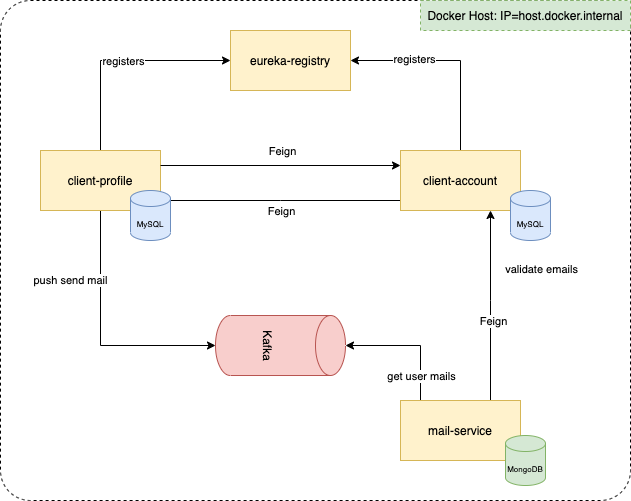

# Load balancer

## eureka-registry
A service to start the server for Microservice Registration and Discovery with Spring Cloud

`http://localhost:8761/`

## kafka-docker
A service to start the server for Kafka async event
`http://localhost:9092/`

## mysql-docker
A service to start the server for Mysql Database
`http://localhost:3306/`

## client-account
A client account service for the user account for all apps like CRM
`http://localhost:8580/`

## client-profile
A client profile service for the app
`http://localhost:8581/`

## mail-service
A client account service for the user account for all apps like CRM
`http://localhost:8582/`

## Architecture diagram

